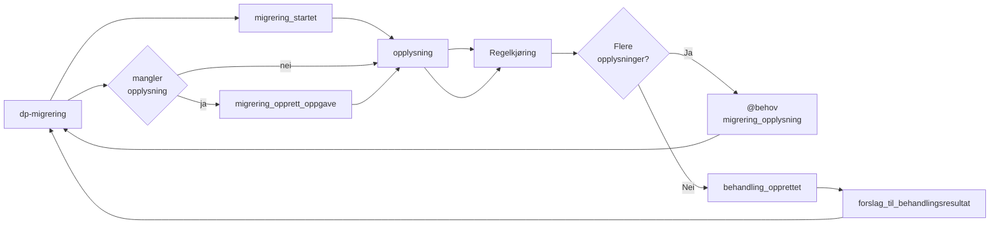

#

```mermaid
flowchart LR
    DPM["dp-migrering"] --> MSE["migrering_startet"]
    MSE --> O["opplysning"]
    O --> RK["Regelkjøring"]
    RK -->FO{"Flere\nopplysninger?"}
    FO -->|Ja| OB["@behov\nmigrering_opplysning"]
    OB --> DPM
    DPM -->HIO{"mangler\nopplysning"}
    HIO --> |nei| O
    O --> RK
    HIO --> |ja| MOOG["migrering_opprett_oppgave"]
    MOOG --> O
    FO -->|Nei| BO["behandling_opprettet"]
    BO --> FTBR["forslag_til_behandlingsresultat"]
    FTBR --> DPM
  
```